## Set up Signal

### Get a free phone number from Google

If you have a Google account you can create a new free phone number.

### Install openjdk on mac

`brew install openjdk`

### Register (sends SMS verification code)

`./node_modules/signal-sdk/bin/signal-cli -a +1[number] register`

### Verify with the code received

`./node_modules/signal-sdk/bin/signal-cli -a +1[number] verify [number]`

## Run with docker compose

Setup:

```sh
# create a place for claude to put persistent files
mkdir $HOME/signal/storage/memory

# allow group writes (for both the agent and mcp services to access)
chmod -R 775 $HOME/signal/storage

# keep group consistent for new files
chmod g+s $HOME/signal/storage
```

Modify [docker-compose](./docker/docker-compose.yml) with your relevant [env](#env-variables) variables.  The run `docker compose -f docker-compose.yml up`.

Run at startup:

Put your (modified) [docker-compose](./docker/docker-compose.yml) in `$HOME/signal/docker`.  Place your [service](./service/llm-signal.service) in `~/.config/systemd/user/`.

Then:

```sh
systemctl --user daemon-reload
systemctl --user enable llm-signal
systemctl --user start llm-signal
sudo loginctl enable-linger $USER
```

### Env variables

* OPEN_API_COMPATIBLE_ENDPOINT (defaults to "http://host.docker.internal:11434", local Ollama.  If using docker compose, don't update this in `docker-compose.yml`...instead update the BACKEND_SERVICE environment variable for `nginx`.)
* LOG_LEVEL (defaults to "info")
* START_THINK_TOKEN (start token for thinking, defaults to "<think>")
* END_THINK_TOKEN (start token for thinking, defaults to "</think>")
* SIGNAL_BOT_PHONE_NUMBER (your free phone number from Google)
* SIGNAL_USER_ADMIN_NUMBER (your actual phone number)
* SIGNAL_REST_ENDPOINT (endpoint exposed by signal server docker, defaults to http://localhost:9001)

## Network Topology and Security

For ease of use I've given the agent carte blanche.  There is no approval requests for the `bash`, `fileEditor`, or (optional) `mcpCodeClient`.  This requires tight controls elsewhere to ensure that any deleterious actions have a small blast radius.  The [docker-compose](./docker/docker-compose.yml) helps to reduce this blast radius.

Docker itself provides some sandboxing.  For example, the agent can only operate on host files via the mounted volume.  The agent could change directory, but will only be traversing directories in the docker container itself.  The agent does NOT have write access to its own code within the docker container.

### Private Networks

The network topology limits what the agent service and the code mcp service can access.  The agent can only access github.com, npmjs.com, pypi.org, and the LLM Api. the code mcp service can only access github.com, npmjs.com, and pypi.org.  Programatically the agent service only accesses the LLM Api.



## Develop

### Run signal server locally

```sh
docker run  -p 9001:8080 \
    -v $HOME/.local/share/signal-cli:/home/.local/share/signal-cli \
    -e MODE=json-rpc-native bbernhard/signal-cli-rest-api:0.99-rootless
```

### Env variables

Create a .env in the project directory with the following entries

```sh
SIGNAL_BOT_PHONE_NUMBER="free_phone_number_you_got_from_google"
SIGNAL_USER_ADMIN_NUMBER="your_actual_phone_number"
OPEN_API_COMPATIBLE_ENDPOINT="URL for your hosted model"
```

### Run

```sh
node index.ts
```

### Run CLI without Signal for debugging

```sh
MOCK=yes node index.ts
```
